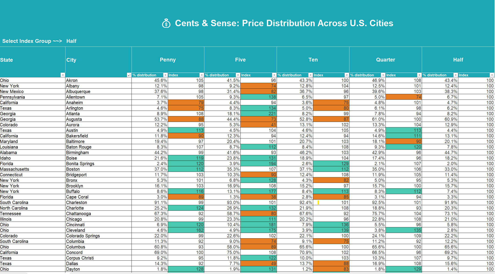

# 💰 Cents & Sense: Price Distribution Across U.S. Cities

## 📌 Overview
An Excel dashboard exploring how U.S. cities distribute consumer spend across denominations — from pennies to half dollars.

## 🛠️ Tools Used
- Microsoft Excel
- Conditional Formatting
- INDEX/MATCH Logic
- Pivot Tables

## 📊 Key Features
- Indexed city-wise spend distribution
- Color-coded heatmap across denominations
- Clean, minimal dashboard design

## 📁 Files
- `CentsAndSense_Dashboard.xlsx`

## 🖼️ Preview

## 🔗 View the File  
[📂 Click here to view the Excel dashboard](https://github.com/prakshalishah/cents-and-sense-dashboard/blob/main/CentsAndSense_Dashboard.xlsx)
